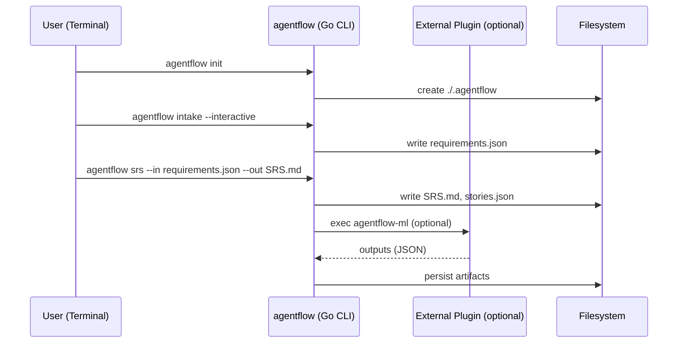

# ARCHITECTURE.md — Go‑first CLI Design

สถาปัตยกรรมนี้โฟกัสที่การสร้าง “เครื่องมือ CLI ด้วยภาษา Go (Golang)” โดยใช้โครงสร้างมาตรฐานของแอป CLI: Cobra สำหรับคำสั่ง/ซับคำสั่ง, Viper สำหรับคอนฟิก/ENV, โฟลเดอร์แบบ `cmd/<app>` + `internal/...` เพื่อให้ทดสอบและบำรุงรักษาง่าย และรองรับปลั๊กอิน/ส่วนขยายในอนาคตเมื่อจำเป็น

---

## 1) High‑level Overview (CLI‑first)

- รูปแบบ: Single binary CLI ที่ติดตั้งได้ด้วย Homebrew/Scoop/ดาวน์โหลดไฟล์
- Framework: Cobra (commands), Viper (config), Zap/Logrus (logging)
- โครง: `cmd/agentflow/` (entrypoint) + `internal/...` (core/business), `pkg/...` (public libs ถ้ามี)
- I/O: รับค่าจาก flags/ENV/ไฟล์, อ่าน/เขียนไฟล์, stdout/stderr, exit codes ชัดเจน
- ส่วนเสริม: สนับสนุนปลั๊กอินแบบ exec (เช่น `agentflow-<plugin>`) หรือ gRPC หากจำเป็น


```mermaid
flowchart LR
  User[User (Terminal)] --> CLI[agentflow (Go CLI)]
  CLI --> FS[(Filesystem\n.agentflow)]
  CLI -. optional .-> Plugin[External Plugin\n(exec/gRPC)]
  Plugin -. writes .-> FS
```

---

## 2) Components (CLI‑centric)

- **cmd/agentflow**: entrypoint หลัก สร้าง root command และ subcommands เช่น `init`, `intake`, `srs`, `plan`, `run`
- **internal/intake**: โมดูลถาม‑ตอบ requirement (interactive TUI/CLI) + export JSON/Markdown
- **internal/srs**: แปลง requirement เป็น SRS/User Stories/AC
- **internal/agents**: รัน workflow ของเอเจนต์แบบลำดับขั้น (intake → sa → architect → planner → dev/qa → review)
- **internal/io**: จัดการไฟล์ในโฟลเดอร์ `./.agentflow/...` สำหรับโปรเจกต์
- **internal/config**: อ่าน config จากไฟล์และ ENV ด้วย Viper
- **optional/external**: ปลั๊กอินภายนอก (exec or gRPC) สำหรับงานหนัก/เฉพาะทาง

---

## 3) File-based Data Model (สรุป)

- project manifest: `./.agentflow/project.json`
- requirements: `./.agentflow/intake/requirements.json` + `summary.md`
- SRS & stories: `./.agentflow/analysis/SRS.md`, `./.agentflow/analysis/stories.json`
- planning: `./.agentflow/planning/tasks.json`, `plan.md`
- run logs: `./.agentflow/runs/<ts-id>/{agent.json,logs.ndjson,artifacts/...}`
- artifacts: `./.agentflow/artifacts/<artifact-id>/{meta.json,data.*}`
- attachments: `./.agentflow/attachments/*`
- configs: `./.agentflow/configs/cli.yaml`

> หมายเหตุ: รูปแบบไฟล์ต้องเป็นเวอร์ชัน และ validate ได้ด้วย schema เพื่อให้ Agents ข้ามภาษาทำงานร่วมกันได้

---

## 4) CLI Commands & Versioning

- คำสั่งหลัก: `agentflow init`, `agentflow intake`, `agentflow srs`, `agentflow plan`, `agentflow run`
- Versioning: แสดงเวอร์ชันด้วย `agentflow --version`; ฝังข้อมูล build (commit/date) ผ่าน `-ldflags`
- Output: พิมพ์เป็น stdout (human/readable) และรองรับ `--json` เพื่อให้เครื่องอ่านได้
- Conventions: exit code 0 = สำเร็จ, อื่น ๆ = ล้มเหลวพร้อมข้อความสั้น ๆ

---

## 5) Messaging & Contracts

- Exchange: `agent` (type: topic)  
- Routing keys: `ml.*`, `doc.parse.*`, `qa.run.*`, `ops.*`  
- Envelope (ดู AGENTS.md) — ต้อง **versioned** และตรวจ schema ทุกครั้ง  
- ผลลัพธ์ publish กลับด้วย `*.done` + payload อ้างอิง `taskId`

---

## 6) Security (CLI)

- **Secrets**: อ่านจาก ENV/ไฟล์คอนฟิก (Viper) และหลีกเลี่ยงการพิมพ์ลง stdout/log โดยไม่จำเป็น
- **Least privilege**: จำกัดสิทธิ์ไฟล์คอนฟิก (`0600`), แยกโทเคนตามบทบาท/สcope
- **Network**: ตรวจสอบ TLS เมื่อเรียกบริการภายนอก, รองรับ proxy/corporate CA หากจำเป็น
- **Supply chain**: ใช้ Go modules พร้อม `go.sum`; เปิดใช้ `-trimpath`; พิจารณา SLSA/Goreleaser provenance
- **Prompt safety**: sanitize context, block untrusted exec/plugins โดยใส่ allowlist

---

## 7) Observability (CLI)

- Structured logs (Zap/Logrus) พร้อม fields เช่น `project`, `task`, `run`
- Verbosity flags: `-v/--verbose`, `--trace` สำหรับ debug ขั้นสูง
- Exit codes ชัดเจน + สรุปผลสั้นๆ ที่ stderr เมื่อผิดพลาด

---

## 8) Performance & Scalability (CLI)

- เริ่มต้นเร็ว (cold start < 200ms ถ้าเป็นไปได้), ประหยัดหน่วยความจำ
- ประมวลผลไฟล์แบบ stream เมื่ออ่าน/เขียนข้อมูลขนาดใหญ่
- รองรับ parallelism แบบ `--concurrency N` เมื่อเหมาะสม

---

## 9) Distribution & Releases

- Build ด้วย `go build`/Goreleaser สำหรับหลายแพลตฟอร์ม (darwin/linux/windows; amd64/arm64)
- แจกจ่ายผ่าน Homebrew/Scoop/Archives; เซ็นไบนารีถ้าจำเป็น
- ตัวอย่าง ENV ที่ CLI ใช้:
```bash
OPENAI_API_KEY=...
OPENAI_MODEL=gpt-5.0-thinking
HTTP_PROXY=...
NO_COLOR=1 # ปิดสีสำหรับ CI
```

---

## 10) Failure Modes & Resilience

- Retry with DLQ (dead‑letter queue) ต่อ routing‑key สำคัญ  
- Idempotency key สำหรับคำสั่งซ้ำ  
- Circuit breaker สำหรับ calls ภายนอก  
- Graceful shutdown (drain messages) ใน workers

---

## 11) Mermaid Sequences (CLI)

### Kickoff → Results


---

## 12) Roadmap

- GitHub PR auto‑create per agent  
- Evaluation harness (self‑critique)  
- Playwright/Vitest/k6 CI  
- Knowledge base ต่อโปรเจกต์ (embeddings)  
- Monte Carlo timeline estimator

---

## 1.1 CLI Components (โครงสร้างโฟลเดอร์)
- `cmd/agentflow/` — main และ root command (Cobra)
- `internal/config/` — Viper config, default values, ENV binding
- `internal/intake/` — โมดูล intake/interview (interactive/non-interactive)
- `internal/srs/` — สร้าง SRS/User Stories/AC
- `internal/io/` — จัดการไฟล์/โฟลเดอร์, JSON/Markdown helpers
- `pkg/...` — ไลบรารีสาธารณะ (ถ้าต้องการให้ผู้อื่นใช้ซ้ำ)

---

## 2.1 CLI Integration (ตัวอย่างโค้ด)

**cmd/agentflow/main.go (Cobra root):**
```go
package main

import (
  "fmt"
  "os"
  "github.com/spf13/cobra"
  "github.com/spf13/viper"
)

var rootCmd = &cobra.Command{
  Use:   "agentflow",
  Short: "AI software workflow CLI",
}

func init() {
  cobra.OnInitialize(initConfig)
  rootCmd.PersistentFlags().BoolP("verbose", "v", false, "enable verbose logging")
  viper.BindPFlag("verbose", rootCmd.PersistentFlags().Lookup("verbose"))
}

func initConfig() {
  viper.SetConfigName("config")
  viper.SetConfigType("yaml")
  viper.AddConfigPath("$HOME/.config/agentflow")
  viper.AutomaticEnv()
  _ = viper.ReadInConfig()
}

func main() {
  if err := rootCmd.Execute(); err != nil {
    fmt.Fprintln(os.Stderr, err)
    os.Exit(1)
  }
}
```

**internal/intake/intake.go:**
```go
package intake

type Question struct { Key, Ask string }

type Result struct { Questions []Question; Decisions []string }

func RunInteractive() (Result, error) { /* ... */ return Result{}, nil }
```

**เพิ่ม subcommand ตัวอย่าง:**
```go
var intakeCmd = &cobra.Command{
  Use:   "intake",
  Short: "Collect requirements interactively",
  RunE: func(cmd *cobra.Command, args []string) error {
    // call intake.RunInteractive()
    return nil
  },
}

func init() { rootCmd.AddCommand(intakeCmd) }
```
