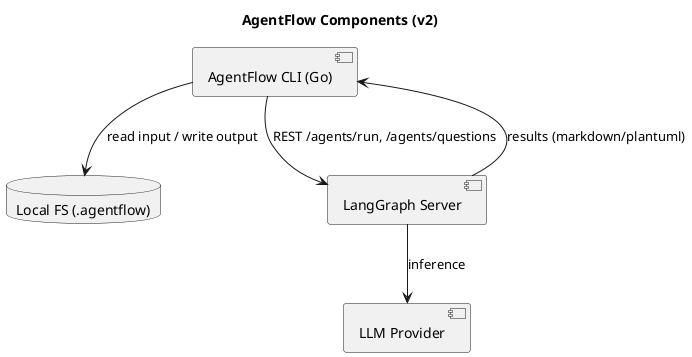
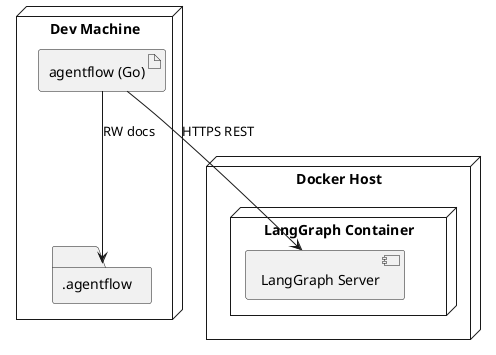

# AgentFlow — Architecture (v2)

**Date:** 2025-09-15

## 1. Overview
CLI (Go) ↔ LangGraph (Docker, REST) ↔ LLM Provider. เอกสารถูกเก็บใน `.agentflow/output`

## 2. Component Diagram


## 3. Deployment Diagram


## 4. Project Structure (Go + LangGraph)
```
agentflow/
  cmd/
    agentflow/            # main.go (cobra/urfave/stdlib flags)
  internal/
    config/               # load/validate config.json
    io/                   # read input/md, write output
    prompt/               # templates, timeline compiler
    agentclient/          # REST client (run/questions), retry/backoff
    stages/
      intake/
      plan/
      design/
      qa/
      devplan/
    util/                 # logging, ids, metadata
  pkg/                    # optional public utils
  scripts/
    dev/                  # run docker langgraph, lint, test
  .agentflow/
    input/                # YYYY-MM-DD.md (ideas timeline)
    output/               # generated docs
  docker/
    langgraph/            # Dockerfile, compose.yml
```

## 5. REST Contracts
- `POST /agents/run` → `{role, prompt, params}` → `{runId, content}`
- `POST /agents/questions` → human-in-the-loop

## 6. Data/Metadata
- เขียน YAML frontmatter (runId, stage, model, time) บนเอกสารทุกไฟล์เพื่อ traceability
