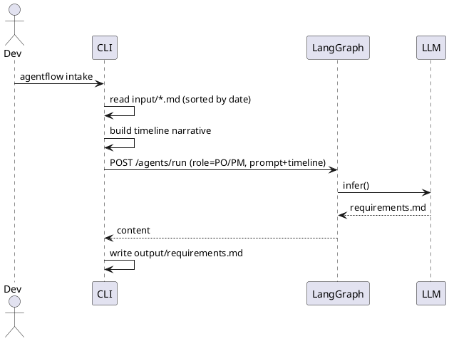
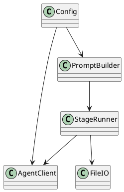
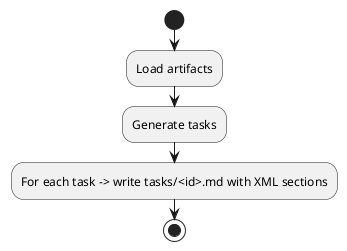

# AgentFlow — UML (v2)

**Date:** 2025-09-15

## Sequence: Timeline Intake

```plantuml
@startuml
actor Dev
participant CLI
participant LGS as "LangGraph"
participant LLM

Dev -> CLI: agentflow intake
CLI -> CLI: read input/*.md (sorted by date)
CLI -> CLI: build timeline narrative
CLI -> LGS: POST /agents/run (role=PO/PM, prompt+timeline)
LGS -> LLM: infer()
LLM --> LGS: requirements.md
LGS --> CLI: content
CLI -> CLI: write output/requirements.md
@enduml
```

## Class: Core

```plantuml
@startuml
class Config
class AgentClient
class PromptBuilder
class StageRunner
class FileIO

Config --> AgentClient
Config --> PromptBuilder
PromptBuilder --> StageRunner
StageRunner --> AgentClient
StageRunner --> FileIO
@enduml
```

## Activity: DevPlan

```plantuml
@startuml
start
:Load artifacts;
:Generate tasks;
:For each task -> write tasks/<id>.md with XML sections;
stop
@enduml
```
