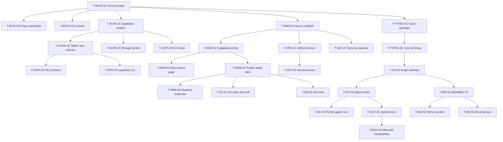

# tasks.md — AI Software House (TS-first, Supabase-first)

ไฟล์นี้เป็นแผนงานหลักสำหรับโปรเจกต์ AI Software House ที่ใช้ TypeScript เป็นแกน และ Supabase เป็น backend หลัก
ใช้เป็น To-Do, อ้างอิงการพึ่งพางาน และรีวิวความคืบหน้าได้ทันที

---

## วิธีใช้
- ติ๊กเช็กลิสต์ทีละข้อ
- อัปเดตสถานะตามเวิร์กโฟลว์มาตรฐาน: `todo -> in_progress -> review -> done` (ถ้ามีปัญหาใช้ `blocked` พร้อมเหตุผล)
- แต่ละงานมีรหัส เช่น `T-WEB-01` เพื่ออ้างอิงใน PR, คอมมิต, หรือฐานข้อมูล

---

## Milestones
- **M1 Bootstrap**: โครง monorepo และมาตรฐานเครื่องมือ
- **M2 Supabase foundation**: ตาราง, RLS, Storage, คีย์ .env
- **M3 Web scaffold**: Next.js, Supabase client, หน้าเริ่มต้น
- **M4 Orchestrator and Agents**: LangGraph, โหนดเอเจนต์, บันทึก agent_runs
- **M5 MQ and Workers**: RabbitMQ ผูกกับ worker ภาษาอื่น
- **M6 QA and DevOps**: แผนทดสอบและ CI
- **M7 Docs and Diagrams**: ปรับเอกสารให้ตรงของจริง

---

## เช็กลิสต์ตามหมวด

### A. Bootstrap and Repo
- [x] **T-BOOT-01** Init monorepo ด้วย pnpm workspaces และโครง `apps web`, `packages types`, `services python-ml`
- [x] **T-BOOT-02** ตั้งค่าไฟล์มาตรฐาน `.editorconfig`, `.nvmrc`, `.gitignore`, `CODEOWNERS`, `SECURITY.md`
- [x] **T-BOOT-03** ใบอนุญาตแบบไม่เชิงพาณิชย์ ใส่ `LICENSE` และ README ชัดเจน

### B. Supabase backend หลัก
- [x] **T-SUPA-01** สร้างโปรเจกต์ Supabase และเปิดใช้งาน pgvector
 - [x] **T-SUPA-02** สร้างตารางและดัชนีหลัก `projects`, `requirements`, `artifacts`, `tasks`, `task_dependencies`, `agent_runs`, `messages`, `memories`, `project_members`
 - [x] **T-SUPA-03** เขียน RLS policies สำหรับ projects และ tasks รวมถึงตารางที่เกี่ยวข้อง
- [ ] **T-SUPA-04** ตั้ง Storage bucket ชื่อ `artifacts` และโครงพาธ `artifacts/<projectId>/...`
- [ ] **T-SUPA-05** ตั้งค่า `.env` ใส่ `SUPABASE_URL`, `SUPABASE_ANON_KEY`, `SUPABASE_SERVICE_ROLE_KEY`

### C. Next.js Web UI และ Orchestrator TS
- [ ] **T-WEB-01** สร้าง Next.js TypeScript พร้อม Tailwind, shadcn ui, Zustand
- [ ] **T-WEB-02** ต่อ Supabase client และ admin บน server side
- [ ] **T-WEB-03** หน้า `new project` สำหรับ kickoff
- [ ] **T-WEB-04** หน้า `project detail` พร้อมแท็บ Chat, SRS, Tasks Kanban, Agents, Artifacts, Activity
- [ ] **T-WEB-05** Realtime subscribe ตาราง `tasks`, `agent_runs`, `messages`

### D. Types และ Contracts
- [ ] **T-TYPES-01** แพ็กเกจ `packages types` สำหรับ Zod หรือ TypeBox
- [ ] **T-TYPES-02** สร้างสคีมา `Questions`, `Stories`, `TaskItem`, `Tasks`, `JobEnvelope`

### E. Orchestrator และ Agents
- [ ] **T-AG-01** โครงกราฟ LangGraph เบื้องต้น
- [ ] **T-AG-02** โหนดเอเจนต์ intake, sa, architect, planner, fe, be, qa, reviewer
- [ ] **T-AG-03** บันทึก I O เอเจนต์ลง `agent_runs` และแนบลิงก์ artifacts

### F. Messaging และ Polyglot
- [ ] **T-MQ-01** ผูก RabbitMQ บนฝั่ง TypeScript ด้วย amqplib สร้าง exchange แบบ topic
- [ ] **T-MQ-02** ตั้งค่า worker ภาษา Python ด้วย pika สำหรับงาน ML หรือ OCR
- [ ] **T-MQ-03** นิยาม routing keys มาตรฐาน เช่น `ml.*`, `doc.parse.*`, `qa.run.*`, `ops.*` และกำหนด `*.done`

### G. QA และ DevOps
- [ ] **T-QA-01** Test plan และชุด unit tests เริ่มต้น
- [ ] **T-QA-02** e2e ด้วย Playwright หรือ Vitest ขั้นพื้นฐาน
- [ ] **T-OPS-01** GitHub Actions CI ตรวจ typecheck, lint, test, build
- [ ] **T-OPS-02** Vercel preview deploy และตั้งค่า environment
- [ ] **T-OPS-03** เวิร์กโฟลว์ supabase CLI สำหรับ migrate และ seed
- [ ] **T-SEC-01** ตั้งค่า Security baseline สำหรับ secrets, CORS, CSRF

### H. Docs และ Diagram
- [ ] **T-DOC-01** ทบทวนและอัปเดต AGENTS md, requirements md, ARCHITECTURE md ให้ตรงของจริง
- [ ] **T-DOC-02** ตรวจ Mermaid ให้เป็น GitHub friendly ใช้ flowchart หรือ sequence

---

## ตารางงานรวม

| ID | ชื่อเรื่อง | บทบาท | ประมาณชั่วโมง | พึ่งพางาน |
|---|---|---:|---|
| T-BOOT-01 | Init monorepo | techlead | 4 | - |
| T-BOOT-02 | Repo standards | techlead | 2 | T-BOOT-01 |
| T-BOOT-03 | Non commercial license | writer | 1 | T-BOOT-01 |
| T-SUPA-01 | Supabase project | devops | 2 | T-BOOT-01 |
| T-SUPA-02 | Tables and indexes | be | 6 | T-SUPA-01 |
| T-SUPA-03 | RLS policies | be | 6 | T-SUPA-02 |
| T-SUPA-04 | Storage bucket artifacts | be | 2 | T-SUPA-01 |
| T-SUPA-05 | Env keys setup | devops | 1 | T-SUPA-01 |
| T-WEB-01 | Next.js scaffold | fe | 4 | T-BOOT-01 |
| T-WEB-02 | Supabase wiring | fe | 3 | T-WEB-01, T-SUPA-01 |
| T-WEB-03 | New project page | fe | 4 | T-WEB-02 |
| T-WEB-04 | Project detail tabs | fe | 10 | T-WEB-02 |
| T-WEB-05 | Realtime subscribe | fe | 4 | T-WEB-04, T-SUPA-01 |
| T-TYPES-01 | Types package | techlead | 4 | T-BOOT-01 |
| T-TYPES-02 | Core schemas | sa | 4 | T-TYPES-01 |
| T-AG-01 | Graph skeleton | architect | 6 | T-TYPES-02 |
| T-AG-02 | Agent nodes | architect | 10 | T-AG-01 |
| T-AG-03 | Persist agent runs | be | 3 | T-AG-02, T-SUPA-02 |
| T-MQ-01 | RabbitMQ TS | be | 4 | T-AG-01 |
| T-MQ-02 | Python worker | devops | 4 | T-MQ-01 |
| T-MQ-03 | Routing keys | techlead | 2 | T-MQ-01 |
| T-QA-01 | Test plan and unit | qa | 6 | T-WEB-01, T-AG-02 |
| T-QA-02 | e2e tests | qa | 6 | T-WEB-04 |
| T-OPS-01 | GitHub Actions CI | devops | 4 | T-WEB-01 |
| T-OPS-02 | Vercel preview | devops | 3 | T-OPS-01 |
| T-OPS-03 | supabase CLI flow | devops | 3 | T-SUPA-02 |
| T-SEC-01 | Security baseline | devops | 3 | T-WEB-01 |
| T-DOC-01 | Update docs | writer | 3 | T-AG-02, T-WEB-04 |
| T-DOC-02 | Mermaid compatibility | writer | 1 | T-DOC-01 |

---

## ผังพึ่งพางานแบบ Mermaid

> หมายเหตุ: ใช้ไวยากรณ์มาตรฐานของ GitHub Mermaid และหลีกเลี่ยงอักขระพิเศษใน label

---

## Definition of Done โดยย่อ
- โค้ดผ่าน typecheck, lint, unit tests, และ e2e หลัก
- งานที่แตะฐานข้อมูลเคารพ RLS และไม่มีข้อมูลอ่อนไหวรั่วไหล
- บันทึก I O ของเอเจนต์ไว้ใน `agent_runs` พร้อมลิงก์ artifacts
- เอกสารถูกอัปเดตให้ตรงกับสิ่งที่ส่งมอบ
